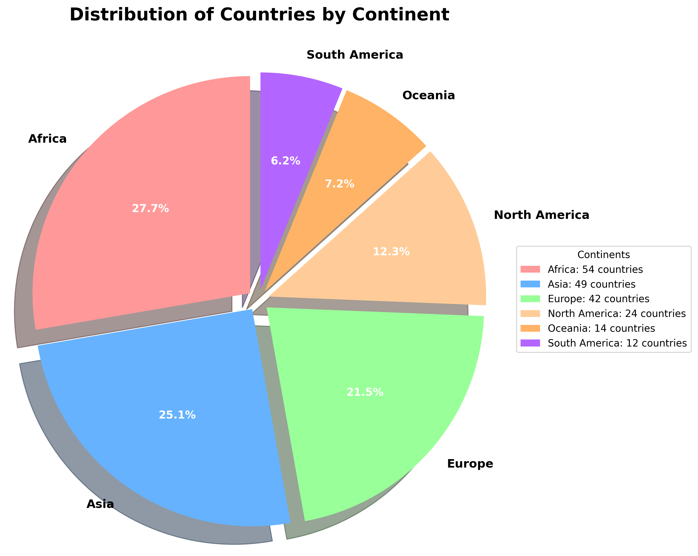
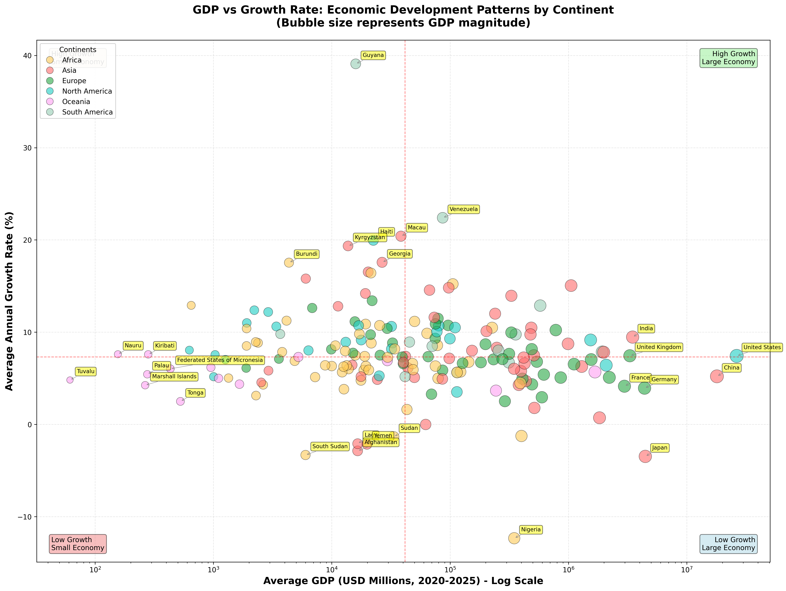
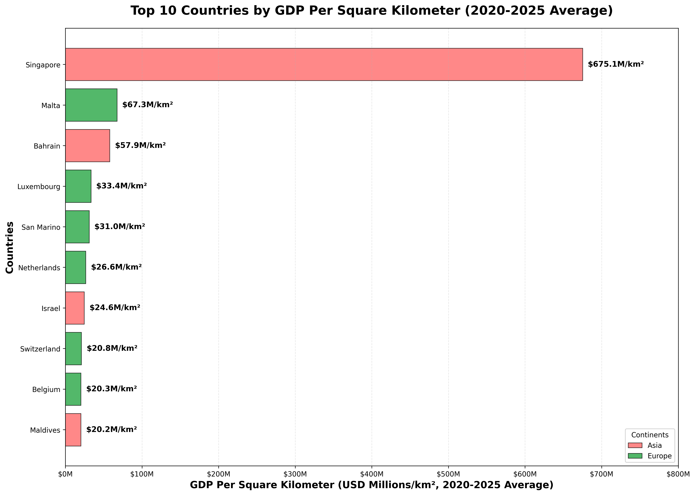

> 环境信息：[kaggle](https://www.kaggle.com/) 内置 Python
> 数据来源：本文采用的数据已经上传至[我的kaggle](https://www.kaggle.com/datasets/jaylorden/world-data)


## 导言
---
本系列[导言](https://imlorden2.github.io/myblog/posts/%E6%95%B0%E6%8D%AE%E5%88%86%E6%9E%90%E5%AE%9E%E4%BE%8B%E5%90%88%E9%9B%86/%E6%95%B0%E6%8D%AE%E5%88%86%E6%9E%90%E5%AE%9E%E4%BE%8B-%E5%AF%BC%E8%A8%80/)中曾说：

> 数据是认识世界的方式。

于是第一个数据分析项目就从世界各个国家的数据开始分析，有助于从数据的角度切实体会世界基本形式。


## 一、数据导入
---

### 1. 导入 GDP 数据

```python
df = pd.read_csv('/kaggle/input/world-data/2020-2025.csv')

print(f'1. Data shape : {df.shape}')
print(f'2. Columns : {list(df.columns)}')
print(f'3. First 5 rows:')
print(df.head(5))
print(f'4. Data types:')
df['2020'] = df['2020'].astype('float64')
print(df.dtypes)
```

```plain
1. Data shape : (195, 7)
2. Columns : ['Country', '2020', '2021', '2022', '2023', '2024', '2025']
3. First 5 rows:
       Country    2020      2021      2022      2023      2024      2025
0  Afghanistan   20136   14278.0   14501.0   17248.0       NaN       NaN
1      Albania   15271   18086.0   19185.0   23388.0   27259.0   28372.0
2      Algeria  164774  185850.0  225709.0  247789.0  264913.0  268885.0
3      Andorra    2885    3325.0    3376.0    3786.0    4038.0    4035.0
4       Angola   66521   84375.0  142442.0  109764.0  115946.0  113343.0
4. Data types:
Country     object
2020       float64
2021       float64
2022       float64
2023       float64
2024       float64
2025       float64
dtype: object
```

导入数据简单输出可知：
- [本数据集](https://www.kaggle.com/datasets/jaylorden/world-data?select=2020-2025.csv)共收集了**195**个国家或地区从2020到2025年**6年**的 GDP 数据；
- 单位是 **百万美元（Million USD，10⁶ USD）**
- 其中除了Country是 object 类型，GDP 都是 float 类型，数据清晰简单；

### 2. 导入大洲数据

```python
# 为 df 添加新列  Continent（大洲信息）
import json

with open('/kaggle/input/world-data//continental.json') as f:
    country_to_continent = json.load(f)  # 将 JSON 文件内容加载为 Python 字典
    continent_col = df['Country'].map(country_to_continent)
    """
    - 取 DataFrame 的 Country 列（国家列）
    - 使用 .map() 方法，根据 country_to_continent 字典进行映射
    - 结果：生成一个新的 Series，内容是每个国家对应的大洲
    """
    df.insert(1, 'Continent', continent_col)

print(df.head())
```

```plain
       Country Continent      2020      2021      2022      2023      2024  \
0  Afghanistan      Asia   20136.0   14278.0   14501.0   17248.0       NaN   
1      Albania    Europe   15271.0   18086.0   19185.0   23388.0   27259.0   
2      Algeria    Africa  164774.0  185850.0  225709.0  247789.0  264913.0   

       2025  data_count  
0       NaN           4  
1   28372.0           6  
2  268885.0           6  
```

这样，就通过导入 [continental.json 数据](https://www.kaggle.com/datasets/jaylorden/world-data?select=continental.json)，为 dataframe 添加了`Continent`新列。

> “七大洲”中南极洲没有被统计的国家，因此 continental.json 中实际上只有 6 个大洲

因此我们首先就可以先来看看“国家-大洲分布图”：

```python
# 核心代码
continent_counts = df['Continent'].value_counts()  # 统计每个大洲的国家数量，返回 Series（按数量降序排列）。

wedges, texts, autotexts = plt.pie(
  continent_counts.values,           # Data values
  labels=continent_counts.index,     # Continent names
  colors=colors,                     # Custom colors
  autopct='%1.1f%%',                # Show percentages
  startangle=90,                     # Start from top
  explode=(0.05, 0.05, 0.05, 0.05, 0.05, 0.05),  # Separate slices
  shadow=True,                       # Add shadow effect
  textprops={'fontsize': 12, 'fontweight': 'bold'}  # Text styling
)
```



- 饼图更能体现各部分的占比情况和识别主题部分
- 非洲和亚洲的国家超过了半数
- 没想到大洋洲也能有 14 各国家吧？

```python
df_oceania = df[df['Continent'] == 'Oceania']
print(df_oceania['Country'])
```

```plain
9                           Australia
58                               Fiji
89                           Kiribati
109                  Marshall Islands
113    Federated States of Micronesia
121                             Nauru
124                       New Zealand
132                             Palau
134                  Papua New Guinea
145                             Samoa
156                   Solomon Islands
175                             Tonga
180                            Tuvalu
188                           Vanuatu
Name: Country, dtype: object
```

- **Australia(澳大利亚)**: 世界第六大国,以袋鼠、考拉和发达经济著称的南半球大陆国家
- Fiji(斐济): 太平洋度假天堂,以珊瑚礁、热带海滩和友好文化闻名
- Kiribati(基里巴斯): 赤道附近的低海拔岛国,因气候变化面临被淹没风险
- Marshall Islands(马绍尔群岛): 美国核试验历史遗留地,由29个环礁组成的微型岛国
- Federated States of Micronesia(密克罗尼西亚联邦): 由607个岛屿组成的联邦国家,"小岛之国"的字面意义
- Nauru(瑙鲁): 世界第三小国,曾因磷酸盐富裕现面临资源枯竭
- **New Zealand(新西兰)**: 以壮丽自然风光、毛利文化和《指环王》拍摄地著称
- Palau(帕劳): 潜水者天堂,拥有水母湖等独特海洋生态系统
- Papua New Guinea(巴布亚新几内亚): 世界语言最多样化国家(800+种),部落文化保存完好
- Samoa(萨摩亚): 波利尼西亚文化发源地之一,"快乐岛民"的代表
- Solomon Islands(所罗门群岛): 二战太平洋战场重要遗址,保留传统美拉尼西亚文化
- Tonga(汤加): 太平洋唯一从未被殖民的君主制岛国
- Tuvalu(图瓦卢): 世界第四小国,正因海平面上升考虑整体移民
- Vanuatu(瓦努阿图): 冒险旅游胜地,拥有活火山和蹦极发源地
> 除澳新外，其余12国均为小型岛国，面临气候变化、经济脆弱等挑战。


### 3. 导入人口数据

```python
df_population = pd.read_csv('/kaggle/input/world-data/population.csv')
df_population['population'] = df_population[['2020', '2021', '2022', '2023', '2024']].mean(axis=1)

df = pd.merge(
  df,
  df_population[['country', 'population', 'countryiso3code']],
  left_on='Country',
  right_on='country',
  how='left'
)

df = df.drop('country', axis=1)

population_col = df.pop('population')
countryiso_col = df.pop('countryiso3code')

df.insert(2, 'population', population_col)
df.insert(1, 'countryiso3code', countryiso_col)

print(df.head())
```


| Country     | countryiso3code   | Continent   |      population |...|
|:------------|:------------------|:------------|----------------:|--:|
| Afghanistan | AFG               | Asia        |     4.07501e+07 |...|
| Albania     | ALB               | Europe      |     2.77756e+06 |...|
| Algeria     | DZA               | Africa      |     4.54518e+07 |...|
| Andorra     | AND               | Europe      | 79648.6         |...|
| Angola      | AGO               | Africa      |     3.56509e+07 |...|


- 对于 [population](https://www.kaggle.com/datasets/jaylorden/world-data?select=population.csv) 中的数据，直接取 2020-2024 年人口的平均值作为各个国家目前的人口
- 人口单位就是（人）

我们来看看全球人口最多和最少的十个国家：


- India(印度): 2023年超越中国成为世界人口第一大国,IT和制药产业发达
- China(中国): 世界第二大经济体,制造业和科技创新全球领先
- United States(美国): 世界第一大经济体和军事强国,科技和金融中心
- Indonesia(印尼): 东南亚最大经济体,世界最大的群岛国家(17000+岛屿)
- Pakistan(巴基斯坦): 南亚核武器国家,农业和纺织业为主要产业
- Nigeria(尼日利亚): 非洲人口第一大国,石油资源丰富的经济体
- Brazil(巴西): 南美洲最大国家,拥有亚马逊雨林和丰富矿产资源
- Bangladesh(孟加拉国): 世界人口密度最高国家之一,纺织业出口全球第二
- Russia(俄罗斯): 世界面积最大国家,能源和军工产业强国
- Mexico(墨西哥): 拉美第二大经济体,制造业和旅游业发达


- Saint Vincent and the Grenadines(圣文森特和格林纳丁斯): 加勒比群岛国,《加勒比海盗》取景地
- Antigua and Barbuda(安提瓜和巴布达): 加勒比度假胜地,拥有365个海滩传说
- Andorra(安道尔): 庇里牛斯山脉中的袖珍公国,滑雪胜地和免税购物天堂
- Dominica(多米尼克): 加勒比"自然之岛",火山温泉和热带雨林资源丰富
- Saint Kitts and Nevis(圣基茨和尼维斯): 加勒比双岛国,以投资入籍计划闻名
- Marshall Islands(马绍尔群岛): 美国核试验历史遗留地,由29个环礁组成的微型岛国
- San Marino(圣马力诺): 世界最古老共和国之一,意大利境内的微型国家
- Palau(帕劳): 潜水者天堂,拥有水母湖等独特海洋生态系统
- Nauru(瑙鲁): 世界第三小国,曾因磷酸盐富裕现面临资源枯竭
- Tuvalu(图瓦卢): 世界第四小国,正因海平面上升考虑整体移民

### 4. 导入面积数据

和导入大洲数据同理，[面积数据](https://www.kaggle.com/datasets/jaylorden/world-data?select=areas.json)同样是一个 json 文件，因此代码如下：

```python
import json

with open('/kaggle/input/world-data/areas.json') as f:
    area = json.load(f)  # 将 JSON 文件内容加载为 Python 字典
    area_col = df['Country'].map(area)
    df.insert(4, 'Area', area_col)

print(df.head())
```

| Country     | countryiso3code   | Continent   |      population |             Area |...|
|:------------|:------------------|:------------|----------------:|-----------------:|--:|
| Afghanistan | AFG               | Asia        |     4.07501e+07 | 652230           |...|
| Albania     | ALB               | Europe      |     2.77756e+06 |  28748           |...|
| Algeria     | DZA               | Africa      |     4.54518e+07 |      2.38174e+06 |...|
| Andorra     | AND               | Europe      | 79648.6         |    468           |...|
| Angola      | AGO               | Africa      |     3.56509e+07 |      1.2467e+06  |...|

> 注：面积的单位是 平方公里 (km²)


## 二、数据探索
---

现在，基本的数据就准备完毕了。有了这么多数据，光瞪眼也只能看出来某一个值很大、某个值很小；或是你可以通过简单查找你感兴趣的国家。 Python 绘图工具可以帮助我们以图表的形式，通过对比更直观地展示一些东西。

### 1. GDP 总量和 GDP 增速

首先对每一个国家六年的 GPD 总量求平均值，来代表这个国家的 GDP 水平。先来看看 GDP 水平最高和最低的10个国家：

```python
# Calculate average GDP for each country (2020-2025)
year_columns = ['2020', '2021', '2022', '2023', '2024', '2025']
df['Average_GDP'] = df[year_columns].mean(axis=1)

# Common function for creating horizontal bar chart
def create_gdp_chart(data_df, title, invert_y=True):
    pass

# Get top 10 countries by average GDP
top_10_gdp = df.nlargest(10, 'Average_GDP')
create_gdp_chart(
    top_10_gdp, 
    'Top 10 Countries by Average GDP', 
    invert_y=True)

# Get bottom 10 countries by average GDP
bottom_10_gdp = df.nsmallest(10, 'Average_GDP')
create_gdp_chart(
    bottom_10_gdp, 
    'Bottom 10 Countries by Average GDP', 
    invert_y=False)
```


我们耳熟能详的大型国家无一例外地出现在这里。另外，柱体颜色用大洲颜色进行了标注，方便判断这些国家是哪个大洲的。或许在这里无伤大雅，但是下面这个图你一定需要。


这些国家能看出来其中8个是大洋洲的岛国。除了它们，还剩两个国家分别是：
- Dominica(多米尼克): 加勒比"自然之岛",火山温泉和热带雨林资源丰富
- São Tomé and Príncipe(圣多美和普林西比): 非洲第二小国,优质可可豆产地

非洲第一小国是谁？

```python
df[df['Continent'] == 'Africa'].nsmallest(1, 'Area')
```

| Country    | countryiso3code   | Continent   |   population |   Area |   2020 |   2021 |   2022 |   2023 |   2024 |   2025 |   Average_GDP |
|:-----------|:------------------|:------------|-------------:|-------:|-------:|-------:|-------:|-------:|-------:|-------:|--------------:|
| Seychelles | SYC               | Africa      |       111745 |    455 |   1384 |   1490 |   2018 |   2187 |   2168 |   2198 |        1907.5 |

就是塞舌尔，刚好这个数据集有所收录。

Seychelles(塞舌尔)：印度洋上的奢华度假胜地，以原始自然美景、珍稀物种和高端旅游闻名的非洲最小国家。拥有世界最美海滩（如安塞拉齐奥海滩）；独特物种丰富，有象龟、海椰子、珍稀鸟类。

作为反映国家经济情况的指标，GDP 增速也同样重要。**气泡图**非常适合用来描述多个变量。相比于散点图，它还有气泡大小和气泡颜色用来表示变量。

```python
# 提取数据
x_values = bubble_data['Average_GDP']           # GDP总量 (X轴)
y_values = bubble_data['Average_Growth_Rate']   # 增长率 (Y轴)

# GDP最大的7国
top_gdp = bubble_data.nlargest(7, 'Average_GDP')

# GDP最小的7国
top_gdp = bubble_data.nsmallest(7, 'Average_GDP')

# 增长率最高的7国
top_growth = bubble_data.nlargest(7, 'Average_Growth_Rate')

# 增长率最低的7国
bottom_growth = bubble_data.nsmallest(7, 'Average_Growth_Rate')
```



- 这里的 平均 GDP 进行了 取对数处理，是为了将大差异的值放在同一张图里，相差一个 x 刻度相当于相差了 10 倍
- GDP 平均增速这里采用了**几何平均数**。相比与算术平均数，它在百分比增长这样存在**复利效应**的情况下描述更加准确
    - CAGR (Compound Annual Growth Rate)：复合年均增长率
    - $CAGR = (最终值 / 初始值)^(1/年数) - 1$


### 2. 人均 GDP

人均 GDP 用以反映国家劳动力创造经济的水平，高人均 GDP 意味着高收入高消费，是用来衡量是否发达国家的重要指标。


- Luxembourg(卢森堡): 欧洲金融中心和避税天堂,人均GDP常年全球第一
- Ireland(爱尔兰): 欧盟科技巨头税务基地,苹果、谷歌等跨国公司欧洲总部所在地
- Switzerland(瑞士): 全球银行业和精密制造中心,以中立国地位和高生活质量著称
- Norway(挪威): 北欧石油富国,主权财富基金规模全球最大,高福利社会典范
- Singapore(新加坡): 亚洲金融和贸易枢纽,以高效治理和零关税自由港闻名
- United States(美国): 世界第一大经济体和科技强国,创新能力和消费市场全球领先
- Iceland(冰岛): 北大西洋岛国,以地热能源、渔业和旅游业为支柱产业
- Qatar(卡塔尔): 中东天然气出口第一大国,人均GDP极高但贫富差距明显
- Denmark(丹麦): 北欧高福利国家,以童话王国、设计产业和绿色能源著称
- Australia(澳大利亚): 资源出口大国,以矿业、农业和宜居环境闻名的南半球发达国家

10 个国家有 7 个来自欧洲，多为金融中心、资源富国和高福利国家，经济结构以服务业或高附加值产业为主。

### 3. 单位面积 GDP

单位面积 GDP 可以反映国家的经济密度、城市化水平、土地利用效率。



1. Singapore (新加坡) - $675.1M/km²
- 特点：全球第一，遥遥领先（是第二名的10倍）
- 原因：
    - 城市国家，100%土地高度开
    - 亚洲金融和贸易中心
    - 全球最繁忙港口之一
    - GDP高达$485亿，但面积仅719 km²
    - 经济模式：金融、物流、高科技制造


2. Malta (马耳他) - $67.3M/km²
- 特点：地中海岛国，欧洲离岸金融中心
- 原因：
    - 旅游业发达（历史遗迹丰富）
    - 吸引外资和跨国公司注册
    - EU成员国，地理位置优越
    - 面积：316 km²（比新加坡还小）


3. Bahrain (巴林) - $57.9M/km²

- 特点：波斯湾岛国，中东金融中心
- 原因：
    - 石油和天然气资源
    - 中东银行业枢纽
    - 连接沙特的跨海大桥促进贸易


4. Luxembourg (卢森堡) - $33.4M/km²

- 特点：欧洲内陆大公国，人均GDP全球第一
- 原因：
    - 国际金融中心（私人银行、投资基金）
    - 欧盟总部所在地之一
    - 税收优惠政策吸引跨国公司


5. San Marino (圣马力诺) - $31.0M/km²

- 特点：世界最古老共和国，意大利境内的袖珍国
- 原因：
    - 旅游业（历史文化遗产）
    - 银行业和邮票销售
    - 免税购物
    - 面积：仅61 km²，全球第五小国


6. Netherlands (荷兰) - $26.6M/km²

- 特点：唯一进入前10的"中型国家"
- 原因：
    - 欧洲门户（鹿特丹港：欧洲第一大港）
    - 农业高科技（温室农业全球领先）
    - 高度城市化（人口密度高）
    - 金融和物流中心


7. Israel (以色列) - $24.6M/km²

- 特点：中东科技强国
- 原因：
    - "创业国度"（高科技、军工产业）
    - 地中海沿岸，土地开发集中
    - 农业技术先进（滴灌技术）
    - 面积：20,770 km²，前10中最大的国家之一

---
8. Switzerland (瑞士) - $20.8M/km²

- 特点：阿尔卑斯山脉国家，高单位面积GDP令人惊讶
- 原因：
    - 全球银行业中心
    - 精密制造（手表、医疗器械）
    - 旅游业（滑雪胜地）


9. Belgium (比利时) - $20.3M/km²

- 特点：欧盟和北约总部所在地
- 原因：
    - 欧洲政治中心
    - 安特卫普港（钻石贸易中心）
    - 化工、制药产业发达


10. Maldives (马尔代夫) - $20.2M/km²

- 特点：印度洋岛国，最低海拔国家
- 原因：
    - 高端旅游业（奢侈度假村）
    - 渔业和水产品出口
    - 土地极度稀缺（1,192个岛屿，总面积仅298 km²）

小型国家通过金融、贸易和旅游实现高效经济模式，但这又何尝不是被迫之举。


### 三、结语
---

世界数据集能做的和能包含的远不止此，本文仅仅是抛出一个示例和一些启发：
- 如何添加数据和探索数据
- 选择正确的可视化方法能否让数据更生动

---
感谢阅读